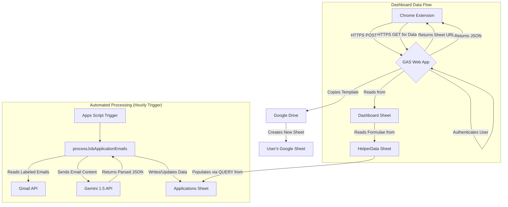

# CareerSuite.AI - Automated Job Application & Lead Tracker

An intelligent, automated job tracker built on the Google Workspace ecosystem. This project serves as the **server-side backend for a Chrome Extension**, transforming your Gmail and Google Sheets into a powerful career management tool.

It automatically parses job application updates and potential leads from your emails, categorizes them using Google Gemini, and visualizes your job search progress on a dynamic dashboard.

---

### Key Features

*   **🤖 AI-Powered Parsing:** Leverages the **Google Gemini 1.5 Flash API** with sophisticated, context-aware prompts to accurately extract Company Name, Job Title, and Application Status from complex emails.
*   **📩 Automated Application Tracking:** A custom Gmail filter automatically labels relevant emails. The script processes these emails, updating a central "Applications" sheet with the latest status (Applied, Interview, Offer, etc.).
*   **💡 Intelligent Job Lead Management:** A separate module identifies and parses potential job leads from email alerts (e.g., from LinkedIn, Wellfound), populating a "Potential Job Leads" sheet for future action.
*   **📊 Dynamic Dashboard:** A comprehensive, auto-updating dashboard in Google Sheets provides key metrics like Total Applications, Active Applications, Interview Rate, and Offer Rate. It features charts visualizing platform distribution, weekly application trends, and a full application funnel.
*   **🔌 Web App Backend for Chrome Extension:** Deployed as a Google Apps Script Web App, this project acts as a secure backend. It handles user authentication, creates personalized tracker sheets from a master template, and serves dashboard data to a front-end Chrome Extension via secure API endpoints.
*   **⚙️ Seamless Gmail Integration:** Creates and manages a full hierarchy of Gmail labels (`CareerSuite.AI/Applications/To Process`, etc.) and sets up filters to automate the entire email triage process without user intervention.
*   **🏗️ Modular & Maintainable Code:** The project is organized into logical modules (`SheetUtils`, `GeminiService`, `WebApp_Endpoints`, etc.) with clear separation of concerns, making it easy to maintain and extend.

### System Architecture

This project is designed as a backend service for a user-facing Chrome Extension, demonstrating a full-stack development approach within the Google Cloud ecosystem.

### Technical Deep Dive

*   **Backend:** Google Apps Script (`WebApp`), providing RESTful API endpoints (`doGet`, `doPost`) for user-specific actions and data retrieval.
*   **AI:** Google Gemini API (`gemini-1.5-flash-latest`) for advanced NLP tasks. The `GeminiService.gs` file showcases detailed prompt engineering to handle the nuances of various job-related emails (ATS confirmations, rejections, job alerts).
*   **Database:** Google Sheets is used as a highly effective, user-accessible database. The project demonstrates advanced sheet manipulation, including dynamic formula creation (`QUERY`, `ARRAYFORMULA`), conditional formatting, and chart generation.
*   **Automation:** Gmail API for label/filter management and Apps Script time-driven Triggers for cron-like job scheduling.
*   **APIs & Services:** The project extensively uses `SpreadsheetApp`, `GmailApp`, `DriveApp`, `UrlFetchApp`, and `PropertiesService` (for storing user-specific data like sheet IDs and API keys).

### Setup & Installation

1.  **Template Sheet:** Create a master Google Sheet that will serve as the template for new users. Note its ID.
2.  **Configuration:**
    *   Open `WebApp_Endpoints.js` and set the `TEMPLATE_MJM_SHEET_ID` constant to your master template's ID.
    *   Review `Config.js` for any desired changes to tab names, labels, or other constants.
3.  **Apps Script Project:**
    *   Create a new Apps Script project bound to your template sheet (or a standalone project).
    *   Copy all the `.js` files from this repository into the Apps Script editor.
4.  **Set API Key:**
    *   Run the `setSharedGeminiApiKey_UI` function from the Apps Script editor menu (`⚙️ CareerSuite.AI Tools > Admin & Config > 🔑 Set Gemini API Key`).
    *   Enter your Google Gemini API key when prompted. This is stored securely in `UserProperties`.
5.  **Run Initial Setup:**
    *   Run `runFullProjectInitialSetup` from the editor or the custom menu. This will:
        *   Create all necessary sheets (`Applications`, `Dashboard`, `Leads`, etc.).
        *   Format all sheets with headers, widths, and branding.
        *   Set up all required Gmail labels and filters.
        *   Create the time-driven triggers for automatic email processing.
6.  **Deploy as Web App:**
    *   Click `Deploy` > `New deployment`.
    *   **Type:** Select `Web app`.
    *   **Description:** "CareerSuite.AI Backend".
    *   **Execute as:** `Me`.
    *   **Who has access:** `Anyone with Google account`.
    *   Click `Deploy`. Grant the necessary permissions.
    *   Copy the generated Web App URL. This URL is the endpoint your Chrome Extension will call.

### License

This project is licensed under the MIT License. See the [LICENSE](LICENSE) file for details.
